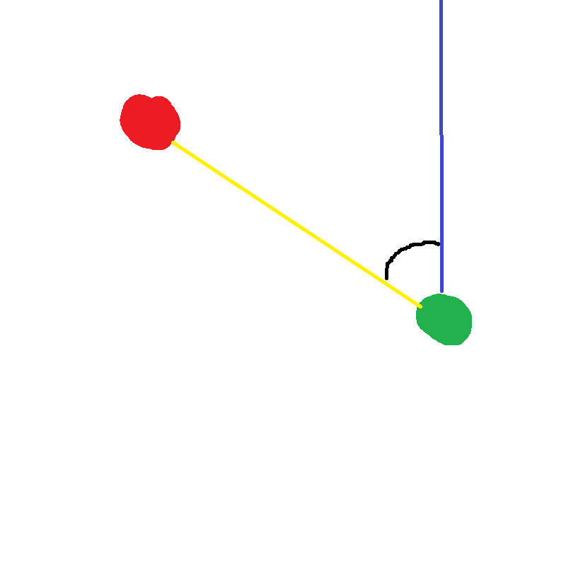

# Compass - Mod for minetest

*This mod adds compasses and special blocks. The compasses are attached to the block and point at it. Blocks and compasses have names.*

### Content
1. [Blocks and Items](#blocks-and-items)
1. [Using](#using)
1. [API](#api)

### Blocks and Items

1. **Point Block**


1. **Compass**


### Using

1. Right click at point block and set name of block.

1. Left click at point block with compass.
1. Left click with compass in hand and its arrow will point at attached block.

### API

**The name and the coordinates of blocks** are stored in **mod_storage**, key is **"compasses"**. 

Function ```changeCompass``` *(line 161)* starts when left click with compass in hand. If there is point block near, then compass gets attached to it.

Else function ```compassImg``` *(line 106)* starts. It controls the arrow.

In the drawing the **red** point is the **point block**, **green** is **player**. **Blue** line is **direction of view**. **Yellow** line built with two points - block point and player coordinates.

Blue and yellow lines are 2D **vectors** *(x-z coordinates)*. **Black** is **angle A between vectors**. It calculates with formula:
```
ab=|a||b|cosA
```
Then use **cross product of vectors** to determine where block is located regarding player`s line of view. If it is on the right then add 180 to **angle A**.

The arrow of compass deviates by an angle A.

